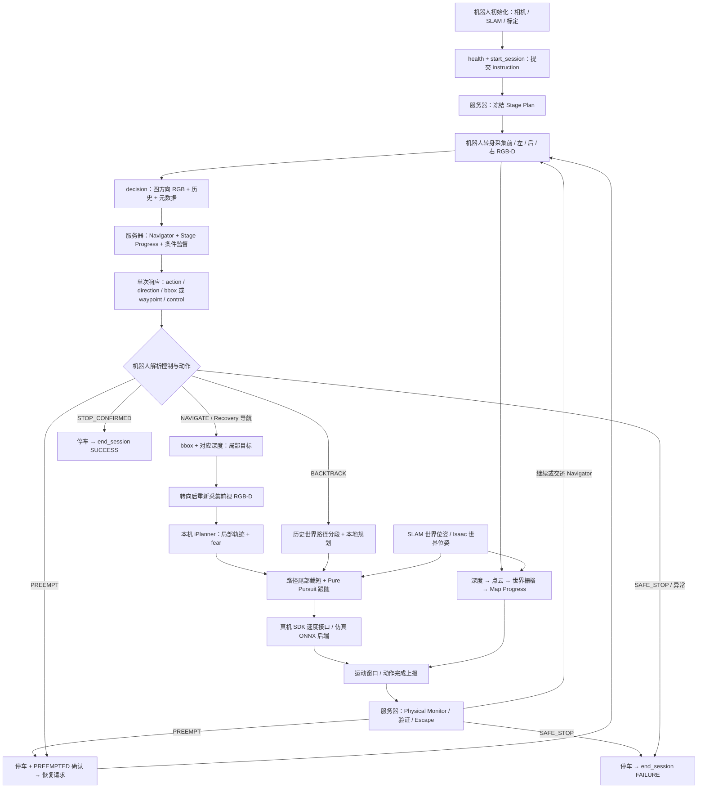

# G1 机器人端与 LaViRA G3：Pipeline 汇报材料

核对日期：2026-09-20。对应 `isaacsim_lavira_g3_interface_g1` 的当前本地实现，以及本地 G3 b92 服务端源码。图中服务器能力需以实际部署的协议响应为准。

## 文件与展示顺序

- **[三页 PDF](G1_G3_pipeline.pdf)**：适合直接发给导师、投屏或打印。中文字体嵌入 PDF。
- **[整体 Pipeline PNG](01_robot_g3_pipeline.png)** / [SVG](01_robot_g3_pipeline.svg)：先讲机器人本地闭环和服务器分工。
- **[通信时序 PNG](02_message_sequence.png)** / [SVG](02_message_sequence.svg)：讲每次发送/接收什么，以及收到后如何处理。
- **[本地几何与部署边界 PNG](03_local_geometry_and_readiness.png)** / [SVG](03_local_geometry_and_readiness.svg)：讲深度、点云、地图、路径跟随与真机适配。
- **[绘图源代码](render_pipeline.py)**：修改文字、布局和颜色后运行 `python render_pipeline.py` 重建。SVG 字体已转路径，便于跨设备显示。

## 可直接讲给导师的介绍

我实现的是机器人侧的感知、几何投影、局部规划、路径跟随和 G3 会话执行闭环。机器人先通过单个前向 RGB-D 相机配合转身采集四方向图像，将 RGB 图像和历史发送给 G3。服务器返回动作、方向、目标框以及阶段和监督结果；机器人用相应视图的深度把目标框投影为局部目标，转向后调用本机 iPlanner 生成轨迹，再用当前位置进行 Pure Pursuit 跟随。

同时，机器人将深度反投影为三维点，结合位姿累计世界坐标下的稀疏探索栅格。执行过程中把运动位移、目标距离变化和地图增长统计回报服务器。服务器根据这些证据进行监督、抢占与恢复；恢复动作仍由同一套本地规划执行链路完成。只有服务器确认 STOP，客户端才结束为 SUCCESS。

IsaacSim 已有完整成功及恢复后成功的记录。真机入口已装配同一状态机、SLAM ROS 2 位姿接口与 Unitree 高层速度接口，但 D435i 驱动适配、真实标定、时间同步和机器人现场验收仍需完成。不能把仿真成功写成真机全部功能已验收。

## 数据走向与坐标

| 数据 | 来源与坐标 | 使用位置 / 是否发送 |
|---|---|---|
| 当前四方向 RGB | 单前向相机转身依次拍摄；有时间先后 | multipart PNG 发给 G3；不是四台相机同时曝光 |
| 历史信息 | 已完成 waypoint 的动作、目标、bbox、初始/方向 RGB | 随 decision 发给 G3；字段按协议提供 |
| 深度与内参 K | 与 RGB 对齐的米单位深度；K 必须对应当前图像 | 留本地做 bbox 投影、探索地图；转换后发给本机 iPlanner |
| 机器人位姿 | 真机 ROS 2 Odometry 的基座 x/y/yaw；仿真 Isaac 世界位姿 | 跟随、旋转、世界历史轨迹、地图融合；通过 execution/report 发给 G3 |
| 点云 | 深度 + K → 相机点；安装几何 + 位姿 → 世界点 | 在机器人 NumPy 数组中计算；当前不上传完整点云、不读取 SLAM PCD |
| 稀疏探索地图 | 本轮累计的世界二维栅格 | 本地统计、可视化；G3 接收统计量，不接收整张栅格 |
| iPlanner 目标/轨迹 | 机器人局部平面坐标 | 本地规划和跟随；不是 G3 给出的全局路径 |
| 运动命令 | vx/vy/wz，机器人平移与偏航速度命令 | 真机 LocoClient.Move；仿真速度接口驱动 ONNX 策略 |

世界坐标是当前 SLAM frame 中的坐标，不是地理绝对坐标。真机必须确认 Odometry 对应基座而非雷达原点；现入口不自动做 TF 外参转换。frame_id 名称变化会终止，但同名 frame 内的重定位跳变不一定被检测。

## 服务器通信顺序

远端服务为 `:8765`。当前实验通过 SSH 将本机 `127.0.0.1:18765` 转发到远端 `127.0.0.1:8765`。本机 `:8888` 是独立 iPlanner，不是 G3。

1. `GET /health`：校验 G3 及各阶段协议、强模型后端等。HTTP 可达本身不等于协议兼容。
2. `POST /v1/lavira/session/start`：提交 `schema_version=2, request_type=start_session, session_id, instruction`。返回 ACTIVE、冻结计划及 READY。完整 instruction 在此提交；G3 decision 不重复发送 instruction。
3. `POST /v1/lavira/decision`：multipart JSON 元数据和 RGB PNG。元数据包括 session/observation/decision/bundle 标识、sim_step（真机中仍沿用字段名）、timestamp、图像尺寸、历史和图片字段映射。服务器完成 Navigator、Stage Progress 和必要监督后，返回**同一个决策响应**。
4. 动作执行中 `POST /v1/lavira/execution/report`，`event_type=motion_window`。默认约 1 s 一个执行窗口；并非保证每秒墙钟严格上报，HTTP/相机/规划耗时可能影响节奏。
5. 动作结束再发同一 endpoint，`event_type=action_complete`。本地更新完成历史，继续四方向观察及下一次 decision；PREEMPT 先停车再确认。
6. STOP_CONFIRMED 时先停止机器人，再 `POST /v1/lavira/session/end`，SUCCESS/stop_confirmed。异常、SAFE_STOP 和人工中断按失败清理，尽力上报；必须检查 ENDED 回执，不能假定 Ctrl+C 一定成功结束远端会话。

### decision 响应与机器人分支

| 服务器字段/结果 | 机器人处理 |
|---|---|
| NAVIGATE + direction + target + bbox_2d | 选择对应视图的深度；bbox 底边中心邻域过滤并取第 30 百分位；得到理想转向后的局部目标；转向、新前视规划、跟随 |
| BACKTRACK + waypoint | 校验历史 waypoint / 世界轨迹，以分段历史路径及本地规划回退；不能直接当成 bbox 导航 |
| action_source=RECOVERY | 来源为恢复规划；执行仍复用 NAVIGATE/BACKTRACK 本地链路；动作完成后由服务端评估 Escape |
| PREEMPT | 中止当前动作并停车；发送 action_complete=PREEMPTED；按服务端状态继续恢复 |
| CONTINUE | 在相应状态继续执行或请求下一轮；不表示整个任务成功 |
| STOP_CONFIRMED | 保持停车，end_session(SUCCESS)；不再把最终 STOP 当成普通导航动作 |
| SAFE_STOP | 停车并按失败原因结束会话 |
| 仅 Navigator 提出 STOP | 不能单凭动作名结束；还要解析 STOP Gate / control / stop_phase |

其他解释性字段包括 `progress_analysis, reasoning, stage_progress, stop_gate, failure_verification, phase5/6/7, recovery`。字段是否出现依触发分支而定。Navigator、Stage Progress 使用导航模型侧；强模型负责条件触发的语义审核、STOP 复核、故障验证、恢复与 Escape。Physical Monitor 的运动统计检测不是每个窗口都调用大模型。

### motion_window 请求字段

共同标识：`schema_version, request_type, event_type, session_id, decision_index, event_id`。

运动窗口：`window_index, action, timestamp_start, timestamp_end, pose_frame_id, frame_epoch, pose_start, pose_end, displacement_m, local_planner_status, distance_to_local_goal_start, distance_to_local_goal_end`。

`pose_start/pose_end` 是 `[x,y,yaw]`；`map_progress` 严格包含四字段：

```json
{
  "resolution_m": 0.05,
  "explored_cells": 15000,
  "new_explored_cells": 120,
  "traversable_cells": 3000
}
```

数字仅为字段示例。`occupied_cells`、地图图片和点云不是这四字段上报的一部分。

### action_complete 请求字段

共同标识加 `action, status, reached_local_goal, timestamp, pose_frame_id, frame_epoch, decision_pose, final_pose, displacement_m, planner_result, waypoint_id`。当前协议 waypoint_id 对应 decision_index。

局部 `COMPLETED/REACHED` 不等于物理上到达图像目标中心，也不等于全任务完成：路径可能已截短、目标可能已在 tolerance 内，passed-goal guard 也会结束本段。Recovery 还需 Escape 证据；全任务还需 STOP_CONFIRMED。

## Map Progress 的实际处理

深度图横纵默认隔 8 像素采样 → 去除非有限值与 0.10–5.0 m 之外的深度 → 内参反投影 → 安装几何与机器人位姿变换 → 世界 x/y 按 5 cm 分格。相机到点的二维射线路径加入 observed；离地 0.10–1.60 m 的点额外标为障碍并按 0.35 m 膨胀。高度筛选只影响障碍分类，全部有效深度点都先参与 observed 统计。

`explored_cells` 为累计观察格数；`new_explored_cells` 为本窗口新增；`traversable_cells` 是非膨胀障碍区域中与机器人连通的已观察格数。当前障碍单调累积，不自动清除错误/动态障碍；这种二维估计不能当作完整可通行地面保证。地图仅提供监督证据，iPlanner 读取自己的前视 RGB-D 输入。

## 当前部署边界与实验证据

- 真机入口使用外部相机工厂，需要实际 D435i 对齐图、正确 depth_scale、对应 K、标定外参和时间戳。当前材料不声称已经完成相机现场接入。
- SLAM 当前订阅 `nav_msgs/msg/Odometry`；Unitree 候选为 `/unitree/slam_mapping/odom` 或 `/unitree/slam_relocation/odom`，实际名称、类型、基座定义仍要现场确认。不是直接订阅 `rt/slam_info` JSON。
- 目前位姿过期判定用接收时间，RGB-D 融合取最新 pose；未实现按采集时间的位姿缓存/插值。
- 地图转换使用 x/y/yaw 和固定高度；未补偿实际步行 roll/pitch/z。几何投影无有效深度时还存在 `[1.5,0]` 的本地前进目标 fallback，真机前应评估该行为。
- iPlanner 调用在当前线程同步执行；20 Hz 导航与 50 Hz DDS 是目标频率，不能宣称端到端严格实时。真机机载控制器实际状态确认仍需硬件联调。
- 已存在仿真完整成功证据：[2026-09-19 看画恢复成功](../../../../outputs/g3_redeploy_check/paintings_retry_20260919_165439_19895/run_20260919_165454_777664/g3_session_ended.json)。这证明该次仿真闭环成功，不覆盖所有真机/故障分支。

## 代码定位

相对路径以本模块根目录为基准：

| 模块 | 代码入口 / 关键函数 |
|---|---|
| 真机装配 | `run_g1_real.py`：`_load_camera_backend`、`_SlamPoseSource`、主循环 |
| 仿真装配 | `run_isaacsim.py`：相机/IsaacRootOdometryProvider/ONNX 执行后端 |
| 共享状态机 | `unified_vln/episode.py`：`_capture_forward_observation`、`_capture_forward_and_plan`、动作分派和执行报告 |
| SLAM | `unified_vln/ros2_odometry.py`：`ingest_odometry`、`get_pose` |
| 决策图像通信 | `unified_vln/model_client.py`：`make_request`、`image_fields`、CombinedModelClient |
| G3 生命周期与执行通信 | `unified_vln/session_client.py`：`start_session`、`report_motion_window`、`report_action_complete`、`end_session` |
| bbox 几何 | `unified_vln/local_projection.py`：`project_selected_view_target` |
| 局部规划 | `unified_vln/iplanner_client.py`：`reset`、`get_plan` |
| 跟随 / 截短 | `unified_vln/local_trajectory.py`；`rotation.py`；`backtrack.py` |
| 世界探索图 | `unified_vln/map_progress.py`：`integrate`、`_optical_points_to_world`、`snapshot` |
| 真机控制 | `unified_vln/g1_dds_backend.py`：UnitreeG1DDSBackend、Move、StopMove |
| G3 服务端参考 | `/home/yile/projects/lavira-g3-b92-service-latest-20260831/lavira_end2end_server.py` |

## 可编辑的 Mermaid 主流程


